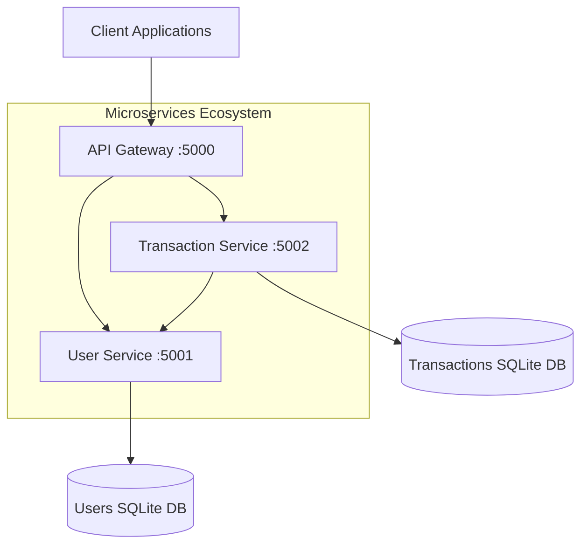
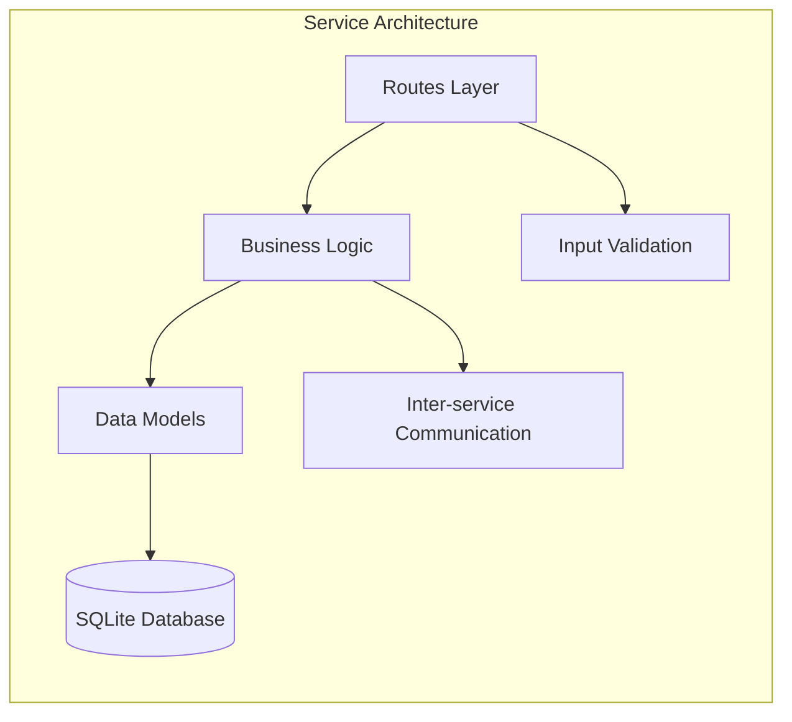
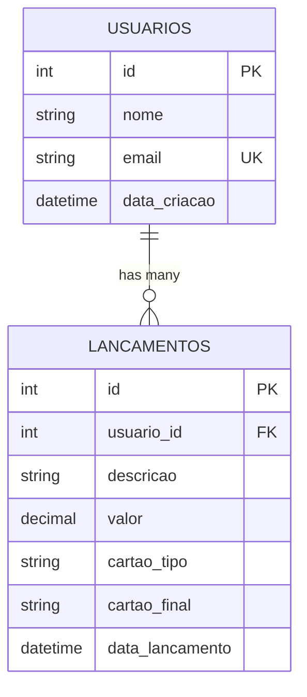
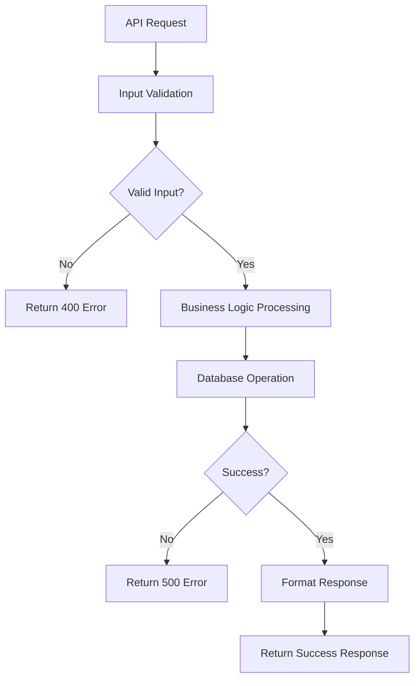
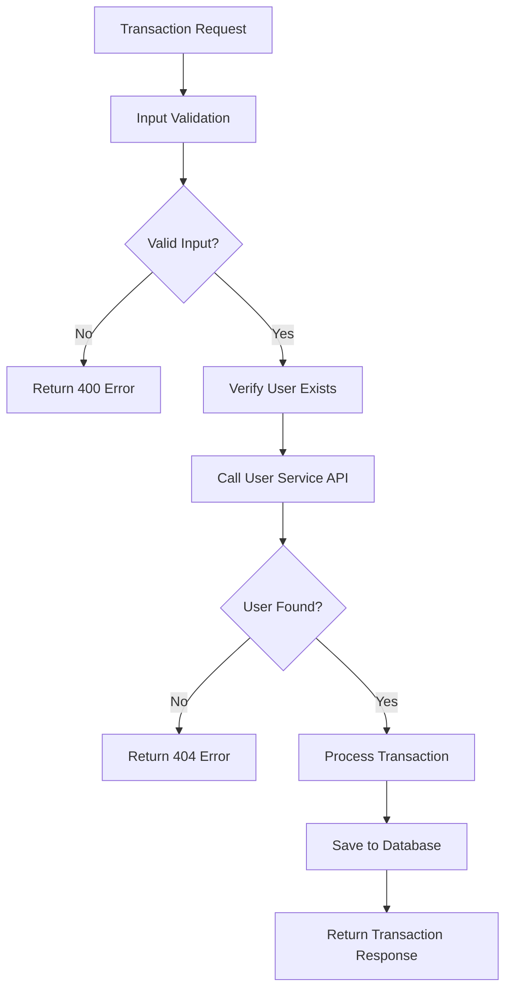
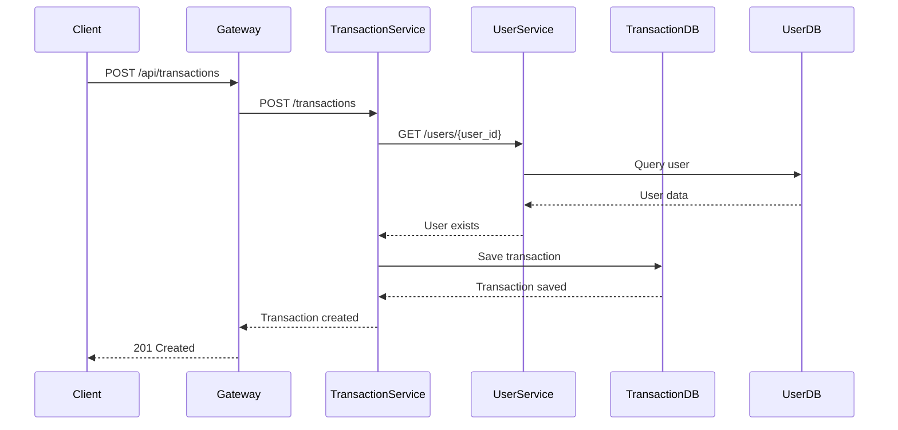

# Flask Microservices System Design

## Overview

This document outlines the design for a Flask-based microservices system that demonstrates modern distributed architecture patterns. The system manages users and financial transactions through separate, loosely-coupled services that communicate via HTTP APIs.

### Core Objectives
- Demonstrate microservices architecture principles using Flask
- Implement RESTful APIs for user and transaction management
- Show inter-service communication patterns
- Provide educational examples of distributed system design
- **Code Documentation Language**: All code comments and documentation will be written in Portuguese

### Key Features
- **User Management**: Complete CRUD operations for user entities
- **Transaction Processing**: Financial transaction recording and retrieval
- **Service Discovery**: API Gateway for request routing
- **Data Persistence**: SQLite databases per service
- **Inter-service Communication**: HTTP-based service-to-service calls

## Architecture

### High-Level Architecture Diagram



### Service Architecture Pattern



### Project Structure

```
projeto/
├── user_service/
│   ├── app.py                 # Configuração da aplicação Flask
│   ├── models.py              # Modelos de dados do usuário
│   ├── routes.py              # Endpoints da API
│   ├── database.db            # Banco de dados SQLite
│   └── config.py              # Configuração do serviço
├── transaction_service/
│   ├── app.py                 # Configuração da aplicação Flask
│   ├── models.py              # Modelos de dados de transação
│   ├── routes.py              # Endpoints da API
│   ├── database.db            # Banco de dados SQLite
│   └── config.py              # Configuração do serviço
├── api_gateway/
│   ├── gateway.py             # Lógica de roteamento do gateway
│   └── config.py              # Configuração do gateway
├── requirements.txt           # Dependências Python
├── docker-compose.yml         # Orquestração de containers
└── README.md                  # Documentação do projeto
```

## Data Models & Database Schema

### Users Table Schema

| Column | Type | Constraints | Description |
|--------|------|-------------|-------------|
| id | INTEGER | PRIMARY KEY, AUTO_INCREMENT | Unique user identifier |
| nome | VARCHAR(100) | NOT NULL | User's full name |
| email | VARCHAR(150) | NOT NULL, UNIQUE | User's email address |
| data_criacao | DATETIME | NOT NULL, DEFAULT CURRENT_TIMESTAMP | Account creation timestamp |

### Transactions Table Schema (Lancamentos)

| Column | Type | Constraints | Description |
|--------|------|-------------|-------------|
| id | INTEGER | PRIMARY KEY, AUTO_INCREMENT | Unique transaction identifier |
| usuario_id | INTEGER | NOT NULL, FOREIGN KEY | Reference to user |
| descricao | VARCHAR(255) | NOT NULL | Transaction description |
| valor | DECIMAL(10,2) | NOT NULL | Transaction amount |
| cartao_tipo | VARCHAR(20) | NOT NULL | Card type (Crédito/Débito/Pré-pago) |
| cartao_final | VARCHAR(4) | NOT NULL | Last 4 digits of card |
| data_lancamento | DATETIME | NOT NULL, DEFAULT CURRENT_TIMESTAMP | Transaction timestamp |

### Entity Relationship Diagram



## API Endpoints Reference

### User Service API (Port 5001)

#### Create User
- **Endpoint**: `POST /users`
- **Description**: Creates a new user account
- **Request Body**:
```json
{
    "nome": "João Silva",
    "email": "joao@email.com"
}
```
- **Response**: `201 Created`
```json
{
    "id": 1,
    "nome": "João Silva",
    "email": "joao@email.com",
    "data_criacao": "2024-01-15T10:30:00Z"
}
```

#### List Users
- **Endpoint**: `GET /users`
- **Description**: Retrieves all users
- **Response**: `200 OK`
```json
[
    {
        "id": 1,
        "nome": "João Silva",
        "email": "joao@email.com",
        "data_criacao": "2024-01-15T10:30:00Z"
    }
]
```

#### Get User by ID
- **Endpoint**: `GET /users/{id}`
- **Description**: Retrieves specific user by ID
- **Response**: `200 OK` or `404 Not Found`

#### Update User
- **Endpoint**: `PUT /users/{id}`
- **Description**: Updates existing user information
- **Request Body**: Same as POST /users

#### Delete User
- **Endpoint**: `DELETE /users/{id}`
- **Description**: Removes user from system
- **Response**: `204 No Content` or `404 Not Found`

### Transaction Service API (Port 5002)

#### Create Transaction
- **Endpoint**: `POST /transactions`
- **Description**: Records a new financial transaction
- **Request Body**:
```json
{
    "usuario_id": 1,
    "descricao": "Compra Amazon",
    "valor": 150.99,
    "cartao_tipo": "Crédito",
    "cartao_final": "1234"
}
```
- **Response**: `201 Created`
- **Validation**: Verifies user exists via User Service API call

#### List All Transactions
- **Endpoint**: `GET /transactions`
- **Description**: Retrieves all transactions

#### Get Transactions by User
- **Endpoint**: `GET /transactions/user/{user_id}`
- **Description**: Retrieves all transactions for specific user
- **Response**: Array of transaction objects

#### Get Transaction by ID
- **Endpoint**: `GET /transactions/{id}`
- **Description**: Retrieves specific transaction

### API Gateway Routes (Port 5000)

| Route | Target Service | Description |
|-------|----------------|-------------|
| `/api/users/*` | User Service (5001) | User management operations |
| `/api/transactions/*` | Transaction Service (5002) | Transaction operations |
| `/api/reports/user/{id}` | Both Services | Aggregated user data |

## Business Logic Layer Architecture

### User Service Business Logic



### Transaction Service Business Logic



### Inter-Service Communication Pattern



## Middleware & Interceptors

### Request Logging Middleware
- Registra requisições recebidas com timestamp, método, URL e IP
- Monitora tempo de resposta e códigos de status
- Implementa logging estruturado para monitoramento de microservices

### Error Handling Middleware
- Padroniza formato de resposta de erro em todos os serviços
- Trata erros de conexão com banco de dados de forma elegante
- Implementa padrão circuit breaker para chamadas entre serviços

### Validation Middleware
- Sanitização e validação de entrada
- Validação de schema para requisições JSON
- Verificação de tipo e validação de formato

### Configuração CORS
- Habilita requisições cross-origin entre serviços
- Configura origens, métodos e headers permitidos
- Trata requisições preflight adequadamente

## Testing Strategy

### Unit Testing Framework
- **Framework**: pytest with Flask-Testing
- **Coverage**: Minimum 80% code coverage requirement
- **Scope**: Individual function and method testing

### Integration Testing
- **Service Integration**: Tests communication between microservices
- **Database Integration**: Tests data persistence and retrieval
- **API Integration**: End-to-end API workflow testing

### Test Categories

#### Testes do Serviço de Usuários
```python
def test_create_user_success():
    # Testa criação bem-sucedida de usuário
    pass

def test_create_user_duplicate_email():
    # Testa validação de email duplicado
    pass

def test_get_user_not_found():
    # Testa cenário de usuário não encontrado
    pass
```

#### Testes do Serviço de Transações
```python
def test_create_transaction_valid_user():
    # Testa criação de transação com usuário válido
    pass

def test_create_transaction_invalid_user():
    # Testa criação de transação com usuário inválido
    pass

def test_get_transactions_by_user():
    # Testa recuperação de transações por usuário
    pass
```

#### Testes do Gateway
```python
def test_gateway_routing():
    # Testa roteamento de requisições para serviços apropriados
    pass

def test_gateway_aggregation():
    # Testa agregação de dados de múltiplos serviços
    pass
```

### Configuração de Dados de Teste
- Bancos de dados de teste isolados para cada serviço
- Fixtures de dados de teste para testes consistentes
- Limpeza do banco de dados após cada execução de teste
- Mock de dependências de serviços externos

### Especificações de Documentação do Código
- **Idioma dos Comentários**: Todos os comentários no código devem ser escritos em português
- **Documentação de APIs**: Documentação inline das APIs em português
- **Comentários de Funções**: Descrições detalhadas de funções e métodos em português
- **Documentação de Classes**: Docstrings de classes em português explicando propósito e uso
- **Comentários de Configuração**: Explicações de configurações e variáveis em português